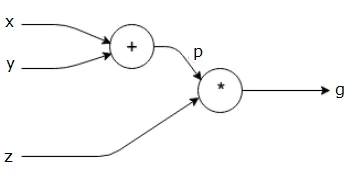
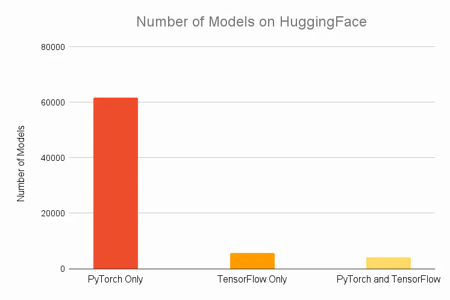
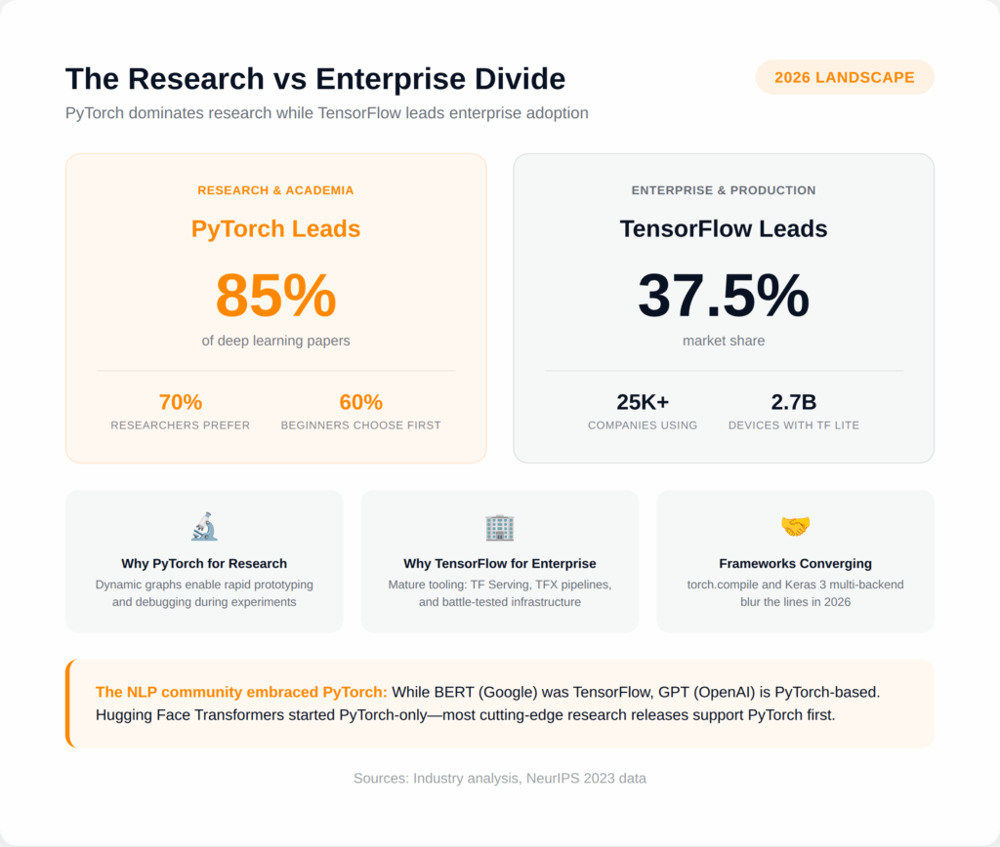

# PyTorch Tutorial: Tensor Operations

## Why PyTorch?


- PyTorch is an open-source deep learning framework that provides a flexible and dynamic approach to building and training neural networks.
- Its popularity and widespread adoption by the research and industry communities.
- PyTorch is widely known for its ease of use, Pythonic interface, and excellent support for research-oriented tasks.

### Key Technology

#### Dynamic Computational Graph

A **computational graph** represents the flow of data through a computational model in the form of a directed acyclic graph (DAG). It serves as a visual representation of the mathematical operations performed on input data to produce the desired output.



PyTorch allows for efficient and flexible model construction and dynamic control flow through its dynamic computational graph. Unlike TensorFlow, another popular deep-learning framework that employs static computational graphs, PyTorch constructs and executes the computational graph dynamically during runtime.

The dynamic nature of PyTorch’s computational graph enables greater flexibility and control flow. The graph is built on-the-fly as operations are executed, making it easier to debug and write code that involves complex or varying control flows. This feature is particularly useful for tasks that require dynamic graph construction, like recurrent neural networks or models with varying input sizes. Additionally, PyTorch’s dynamic nature facilitates seamless integration with Python control flow and external libraries. However, it’s worth noting that the dynamic construction of the graph may result in reduced performance compared to static graphs.

In contrast, TensorFlow follows a static computational graph approach where the graph is defined and compiled before execution. The graph is constructed independently of the actual data being processed, which allows for potential optimization opportunities. Once the graph is defined, it can be executed repeatedly without the need for graph construction, thereby improving performance.

TensorFlow’s static nature facilitates better graph optimization, including automatic differentiation and graph pruning. It is well-suited for scenarios where the model architecture is fixed and known in advance, with a focus on optimizing performance. However, the static nature of TensorFlow’s graph construction may limit flexibility for models with dynamic control flow or varying input sizes. Writing code with TensorFlow’s static graphs can sometimes be more complex and require additional boilerplate code.

#### Automatic Differentiation

[Overview of PyTorch Autograd Engine | PyTorch](https://pytorch.org/blog/overview-of-pytorch-autograd-engine/)

PyTorch’s automatic differentiation is a fundamental feature that enables efficient computation of gradients for training deep learning models. It is tightly integrated with PyTorch’s *dynamic computational graph*, allowing for easy and efficient backpropagation of gradients through the network.

During the forward pass, PyTorch **tracks operations on tensors**, building a dynamic computational graph as these operations are executed. This graph **records the operations and their dependencies**, forming a directed acyclic graph (DAG). Each node in the graph represents an operation, and the edges represent data dependencies.

PyTorch also keeps track of the operations required for computing gradients during the forward pass. It creates a backward pass function for each operation, which calculates the gradient of the output with respect to the input tensors using the chain rule of calculus. During the backward pass, these backward pass functions are invoked to compute gradients efficiently.

The dynamic nature of PyTorch’s computational graph allows for the automatic differentiation process to be performed on a per-graph basis. Gradients are computed dynamically as the forward pass is executed. This dynamic approach offers greater flexibility and control over the model’s behavior, as the graph can change at runtime based on the data or control flow.

To perform backpropagation in PyTorch, you typically define a loss function and call the `backward()` method on the loss tensor. **This triggers the computation of gradients using the dynamic computational graph and the chain rule, updating the gradients of all the model’s parameters.** These gradients can then be used to update the model’s weights using an optimizer, such as stochastic gradient descent (SGD).

Overall, PyTorch’s automatic differentiation capability, combined with its dynamic computational graph, simplifies the process of computing gradients and enables efficient backpropagation for training deep learning models.





> CR: Wu's [tutorial](https://ecwuuuuu.com/post/pytorch-tutorial/#article-info-card).

## How to use PyTorch

### Online Computation Resources

If you are using platforms like Kaggle, Google Colab, or any other similar environment, you typically don’t need to set up the PyTorch environment explicitly. These platforms provide a containerized environment with the necessary computational resources and basic environment already installed.

### Your Own Machine

We are using [Microsoft VS code](https://code.visualstudio.com/) for this tutorial. You can also use Jupyter Notebook or Jupyter Lab for interactive coding.

- [Install Miniconda](https://docs.conda.io/projects/miniconda/en/latest/).
- Create a new conda environment:

   ```bash
   conda create -n comp3340 python=3.10 -y
   conda activate comp3340
   ```

- [Install PyTorch and related libraries](https://pytorch.org/get-started/locally/):

   ```bash
   conda install pytorch torchvision torchaudio pytorch-cuda=11.8 -c pytorch -c nvidia -y
   ```

  - If you have a GPU and want to utilize its power for accelarated computing, make sure to install the appropriate CUDA version that matches your GPU's capabilities. You can check your GPU's compatibility on the [NVIDIA CUDA GPUs](https://developer.nvidia.com/cuda-gpus) page.

  - To install the GPU version of PyTorch, you can use the following command:

    ```bash
    conda install pytorch torchvision torchaudio pytorch-cuda=11.8 -c pytorch -c nvidia -y
    ```

### Using CS GPU Farm

In the coming tutorials for RoboTwin, GPUs are required for simulation and training, so we will be using the [CS GPU farm](https://ai.hku.hk/research/major-facilities?view=article&id=131&catid=24).

## Tensors and Operations

> Let's open `tensor_operations.ipynb` to follow along. You can download it from moodle.

## Recommended Videos to Watch

[Deep Learning Series by 3Blue1Brown](https://youtu.be/aircAruvnKk?si=M3rg9BZsBor8UGz-)

[Neural Networks: Zero to Hero by Andrej Karpathy](https://youtu.be/VMj-3S1tku0?si=EaXbe_iuF7LVM2LU), formerly Director of AI at Tesla and Research Scientist at OpenAI.
