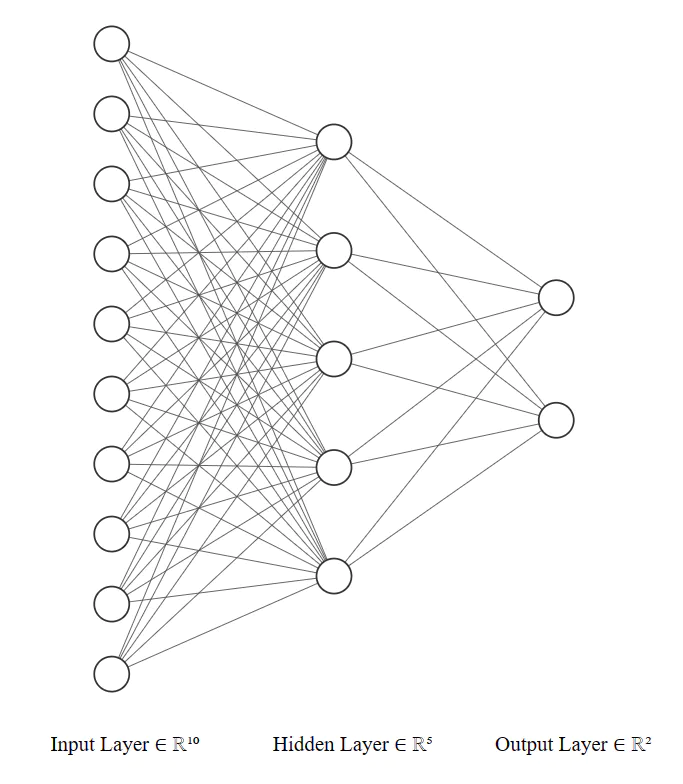

# Optional Tutorial: Building Neural Networks with PyTorch

Below is the optional tutorial for you to learn more about PyTorch model training.

## Building Neural Networks

### `nn.Module` Class

The `nn.Module` class serves as a base class for all neural network modules in PyTorch. It is used to define the architecture and behavior of the network. This class provides a convenient way to organize the parameters of a model and define the forward pass computation. To create your own neural network using `nn.Module`, you need to define a subclass of `nn.Module` and override two key methods: `__init__` and `forward`. The `__init__` method is used to define the layers and modules of your network, while the `forward` method specifies the forward pass computation.

```python
import torch
import torch.nn as nn

class MyNetwork(nn.Module):
    def __init__(self):
        super(MyNetwork, self).__init__()
        # Define the layers and modules of your network
        self.fc1 = nn.Linear(10, 5)
        self.fc2 = nn.Linear(5, 2)
  
    def forward(self, x):
        # Define the forward pass computation
        x = self.fc1(x)
        x = self.fc2(x)
        return x
```



In the `__init__` method, you can define any layers or modules you need for your network. In this example, we define two fully connected layers (`nn.Linear`) with specified input and output sizes. In the forward method, you specify the sequence of operations that will be applied to the input x during the forward pass. In this example, we apply the first linear layer (`self.fc1`), followed by the second linear layer (`self.fc2`).

In this example, we first instantize the network we just defined. And setup the input_data which is a tensor representing the input to your network. You can pass this input tensor to your network instance (model) to obtain the output tensor (output). The forward method of your network will be automatically called, executing the forward pass computation defined earlier.

#### Predifined Layers

PyTorch’s nn module provides a wide range of predefined layers that you can use to build your neural networks. Just like the nn.Linear and nn.ReLU we just use. Here are some commonly used layers:

- nn.Linear: This layer implements a fully connected (linear) operation. It applies a linear transformation to the input data, where each input element is multiplied by a weight and summed with a bias term.
- nn.Conv2d: This layer performs 2D convolutional operations on input data, commonly used in image processing tasks. It applies a set of learnable filters (kernels) to the input tensor to extract local features. nn.Dropout: This layer implements dropout regularization, which randomly sets input elements to zero during training. Dropout helps prevent overfitting by reducing the interdependencies between neurons.
- nn.BatchNorm2d: This layer performs batch normalization along the channels of a 2D input tensor. It normalizes the input by subtracting the mean and dividing by the standard deviation, which helps stabilize and accelerate the training process.
- nn.ReLU: This activation function applies the Rectified Linear Unit (ReLU) element-wise to the input tensor. ReLU sets negative values to zero and keeps positive values unchanged.
- nn.Softmax: This activation function applies the softmax operation to the input tensor, which normalizes the tensor into a probability distribution over the classes. It is commonly used for multi-class classification problems.

```python
class MyNetwork(nn.Module):
    def __init__(self, in_channels, out_classes):
        super(MyNetwork, self).__init__()
        self.conv = nn.Conv2d(in_channels, 64, kernel_size=3, padding=1)
        self.batchnorm = nn.BatchNorm2d(64)
        self.relu = nn.ReLU()
        self.dropout = nn.Dropout(p=0.2)
          
        self.fc1 = nn.Linear(64 * 28 * 28, 128)
        self.fc2 = nn.Linear(128, out_classes)
          
        self.softmax = nn.Softmax(dim=1)
  
    def forward(self, x):
        x = self.conv(x)
        x = self.batchnorm(x)
        x = self.relu(x)
        x = self.dropout(x)
          
        x = x.view(x.size(0), -1)  # Flatten the tensor
          
        x = self.fc1(x)
        x = self.relu(x)
        x = self.dropout(x)
          
        x = self.fc2(x)
        x = self.softmax(x)
          
        return x
```

### Model Summary and Parameters

```python
model = MyNetwork(in_channels=1, out_classes=10)
 
# Print the network structure
print(model)
 
# Calculate the parameter count
total_params = sum(p.numel() for p in model.parameters() if p.requires_grad)
print(f"Total parameters: {total_params}")
 
"""
Output:
 
MyNetwork(
  (conv): Conv2d(3, 64, kernel_size=(3, 3), stride=(1, 1), padding=(1, 1))
  (batchnorm): BatchNorm2d(64, eps=1e-05, momentum=0.1, affine=True, track_running_stats=True)
  (relu): ReLU()
  (dropout): Dropout(p=0.2, inplace=False)
  (fc1): Linear(in_features=50176, out_features=128, bias=True)
  (fc2): Linear(in_features=128, out_features=10, bias=True)
  (softmax): Softmax(dim=1)
)
Total parameters: 6425866
"""
```

There is a convenient package called `torchsummary` that you can use to calculate the total number of parameters in a PyTorch model. Here’s how you can use it:

```python
from torchsummary import summary
 
# Instantiate the network
model = MyNetwork(in_channels=1, out_classes=10)
model = model.to("cuda:0")
# Print the model summary
summary(model, (1, 28, 28))  # Provide an example input size
 
"""
Output:
 
----------------------------------------------------------------
        Layer (type)               Output Shape         Param #
================================================================
            Conv2d-1           [-1, 64, 28, 28]           1,792
       BatchNorm2d-2           [-1, 64, 28, 28]             128
              ReLU-3           [-1, 64, 28, 28]               0
           Dropout-4           [-1, 64, 28, 28]               0
            Linear-5                  [-1, 128]       6,422,656
              ReLU-6                  [-1, 128]               0
           Dropout-7                  [-1, 128]               0
            Linear-8                   [-1, 10]           1,290
           Softmax-9                   [-1, 10]               0
================================================================
Total params: 6,425,866
Trainable params: 6,425,866
Non-trainable params: 0
----------------------------------------------------------------
Input size (MB): 0.01
Forward/backward pass size (MB): 1.53
Params size (MB): 24.51
Estimated Total Size (MB): 26.06
----------------------------------------------------------------
"""
```

For more contents, try running the `optional-img-classfication-training.ipynb` notebook on the moodle.
